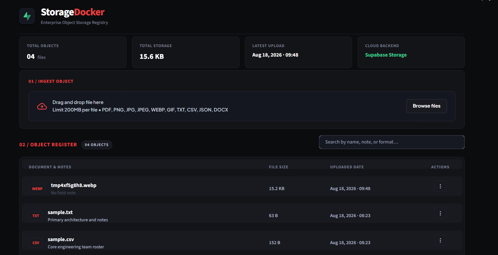

# Supabase File Storage + CRUD App with Python

A terminal-based internship project that stores files in Supabase Storage and keeps searchable metadata in Postgres. Every upload is sent through a Supabase Edge Function that validates the file on the server, calculates its size and SHA-256 checksum, and marks the metadata row active only after validation succeeds.

## What is included

- Python `supabase-py` CLI for Storage + Postgres CRUD.
- Private `documents` Storage bucket with a 10 MB limit.
- `public.file_records` table for filename, uploader label, MIME type, size, checksum, status, and timestamps.
- `validate-upload` Deno Edge Function.
- SQL migration, Storage/RLS policies, deployment instructions, and unit tests.

The upload flow is:

```text
local file
   │
   ├── create pending file_records row
   ├── upload bytes to Storage
   ├── invoke validate-upload Edge Function
   │       ├── download object server-side
   │       ├── validate size, signature, encoding, and MIME type
   │       ├── calculate SHA-256 and update metadata
   │       └── delete rejected objects
   └── return active metadata row
```

## Prerequisites

- Python 3.10 or newer.
- A Supabase project from [supabase.com/dashboard](https://supabase.com/dashboard).
- Supabase CLI installed and available as `supabase`.
- Docker is optional for remote deployment; `supabase functions deploy --use-api` can use API deployment.

## 1. Install the Python app

From this folder:

```powershell
py -m venv .venv
.\.venv\Scripts\Activate.ps1
python -m pip install --upgrade pip
pip install -r requirements.txt
```

Copy the environment template:

```powershell
Copy-Item .env.example .env
```

Edit `.env` and set:

```dotenv
SUPABASE_URL=https://YOUR_PROJECT_REF.supabase.co
SUPABASE_SERVICE_ROLE_KEY=YOUR_SERVER_SIDE_SERVICE_ROLE_OR_SECRET_KEY
EDGE_FUNCTION_SECRET=use-a-long-random-secret
SUPABASE_BUCKET=documents
EDGE_FUNCTION_NAME=validate-upload
APP_USER=internship-terminal-app
```

Keep both keys private. This is a trusted terminal/server application, so the Python client uses a server-side key. Do not put this `.env` file in source control or expose the key in a browser.

## 2. Apply the database and Storage setup

For a remote deployment, replace the local project id in `supabase/config.toml` with your remote ref, then authenticate and link the project:

```powershell
supabase login
supabase link --project-ref YOUR_PROJECT_REF
supabase db push
```

The migration creates:

- `public.file_records` with status values `pending`, `active`, and `rejected`.
- A private `documents` bucket.
- A 10 MB bucket limit and an allow-list for PDF, common images, JSON, CSV, and plain text.
- RLS policies for future authenticated clients.
- Grants for the server-side `service_role`.

## 3. Configure and deploy the Edge Function

The function needs the project URL, a server-side key, and the same request secret that is in `.env`:

```powershell
supabase secrets set `
  SUPABASE_SERVICE_ROLE_KEY="YOUR_SERVER_SIDE_SERVICE_ROLE_OR_SECRET_KEY" `
  EDGE_FUNCTION_SECRET="use-a-long-random-secret"

supabase functions deploy validate-upload --use-api
```

The function is configured with `verify_jwt = false` because it uses its own shared-secret header (`x-edge-function-secret`) and then creates an admin Supabase client internally. The Python app sends that header automatically. This keeps the endpoint callable from the trusted terminal app without depending on the format of legacy versus newer Supabase keys.

For local function development, Docker-compatible runtime is required:

```powershell
supabase functions serve validate-upload --env-file .env
```

The deployed function is tested as part of the `create` and `replace` commands. Each successful call returns generated `size_bytes`, `content_type`, `checksum_sha256`, and `scanned_at` metadata.

## 4. Use the terminal CRUD app

You can run it as a module from the project folder:

```powershell
python -m supabase_crud create .\samples\sample.txt --description "First test upload"
python -m supabase_crud list
```

Copy the returned UUID and use it for the remaining operations:

```powershell
python -m supabase_crud read RECORD_UUID
python -m supabase_crud download RECORD_UUID .\downloads\sample.txt
python -m supabase_crud update RECORD_UUID --description "Updated description"
python -m supabase_crud replace RECORD_UUID .\samples\sample.txt --name "replacement.txt"
python -m supabase_crud delete RECORD_UUID
```

After `pip install -e .`, the equivalent command is `supabase-files`:

```powershell
supabase-files list
```

## Tideframe frontend

The project also includes a minimal Streamlit interface called **Tideframe**. It uses a warm archival-ledger visual system with numbered ingest and register sections, a compact upload well, neutral status text, and short-lived signed download links. The composition is intentionally distinct from a conventional blue SaaS file manager while keeping the workflow immediately understandable.



Start it from the project folder:

```powershell
streamlit run streamlit_app.py
```

The browser app uses the same `FileService` as the CLI, so its actions are real Supabase operations:

- Sidebar upload creates the database row, uploads the object, then invokes `validate-upload`.
- Search and status filtering query `file_records`.
- Download creates a five-minute signed URL for the private object.
- Edit updates metadata only.
- Replace validates a new candidate before swapping it into the record.
- Remove deletes the Storage object and then the Postgres row.

## Supabase CLI verification

The repository includes a Node-based Supabase CLI dependency in `package.json`. Supabase currently recommends a project-local npm install and running it through `npx` on Windows; Node.js 20+ is required.

```powershell
npm install
npx supabase --version
npx supabase status
```

For a real project connection, replace `your-project-ref` in `supabase/config.toml`, then run:

```powershell
npx supabase login
npx supabase link --project-ref YOUR_PROJECT_REF
npx supabase db push
npx supabase secrets set SUPABASE_SERVICE_ROLE_KEY="..." EDGE_FUNCTION_SECRET="..."
npx supabase functions deploy validate-upload --use-api
npx supabase functions list
```

The CLI can also serve the function locally:

```powershell
npx supabase functions serve validate-upload --env-file .env
```

This project follows the current Supabase CLI workflow of installing the CLI as a project dependency and using `npx supabase`; see the [official CLI guide](https://supabase.com/docs/guides/local-development/cli/getting-started). Database migrations require a linked project for `db push`, and function deployment requires CLI authentication as described in the [deployment guide](https://supabase.com/docs/guides/functions/deploy).

### Command reference

| Command | Behavior |
| --- | --- |
| `create FILE` | Inserts a pending row, uploads bytes, invokes the Edge Function, and returns the active row. |
| `list` | Lists metadata rows newest first. |
| `read ID` | Reads one metadata row. |
| `download ID OUTPUT` | Downloads the private Storage object to a local path. |
| `update ID` | Updates metadata only. |
| `replace ID FILE` | Uploads a new object, validates it, swaps the row, then removes the old object. |
| `delete ID` | Removes the Storage object first, then its metadata row. |

## Edge Function behavior

`supabase/functions/validate-upload/index.ts` performs the server-side checks:

1. Authenticates the request using `x-edge-function-secret`.
2. Confirms the record, bucket, and safe Storage path match.
3. Downloads the object with the server-side Supabase client.
4. Checks the 10 MB limit and validates PDF/image signatures or UTF-8 text content.
5. Computes a SHA-256 checksum with Web Crypto.
6. Updates `file_records` with server-observed metadata and `status = active`.
7. On rejection, removes the candidate object and records a validation error for new uploads. Replacement failures leave the old active file in place.

## Testing and verification

Run the local tests:

```powershell
pytest -q
python -m compileall supabase_crud
```

These tests cover path traversal protection, collision-resistant Storage paths, MIME fallback behavior, and size formatting. A real CRUD smoke test requires a configured Supabase project and is run with the commands above.

## Troubleshooting

- `SUPABASE_URL is required`: create `.env` from `.env.example` and fill in the URL.
- `EDGE_FUNCTION_SECRET is required`: set it in both `.env` and `supabase secrets set`.
- `MIME type is not allowed`: use PDF, JPEG, PNG, GIF, WebP, TXT, CSV, or JSON.
- `401 Unauthorized` from the function: the two copies of `EDGE_FUNCTION_SECRET` do not match.
- Storage permission errors: ensure `supabase db push` completed and the Python key is the server-side service role/secret key, not a public browser key.
- Data API errors: make sure `file_records` is exposed in Supabase Dashboard API settings if your project uses an allow-list for public schema tables.
- The repository intentionally keeps the bucket private. Use the CLI `download` command or a signed URL in a future UI instead of making documents public.

## Optional UI extension

The service layer is separate from the CLI, so a Streamlit UI can call the same `FileService.create_file`, `list_files`, `download_file`, `update_metadata`, `replace_file`, and `delete_file` methods without duplicating Storage logic.
